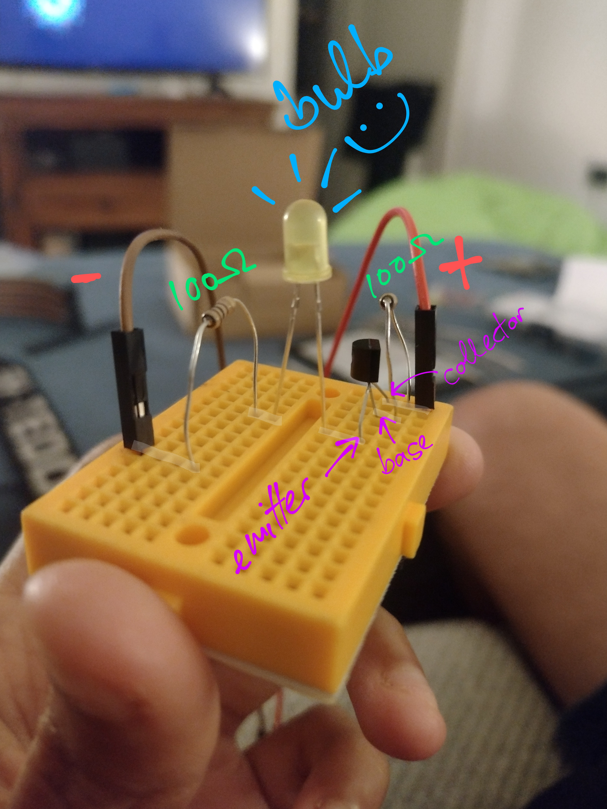

# Notes Dump

For notes that don't have a home yet. Grouped by date to help with creating a timeline, if needed.

## 2022-09-07

* Got the board today, and figured out how to get a light bulb to power up by itself - I used [this helpful video][7] to get me started on how to hook everything up with a breadboard
* Needed to search up the voltage of the light bulb, because it didn't come with the packaging/product description (then needed to use Ohm's law to get voltage down to what the light bulb can support)
* The board was definitely too small and we need to buy a bigger one, especially if we're going to build gates with transistors
* Below is an image of the little bulb setup we built, which also includes the transistor. The faint white lines on the board show where the conenctor lines are. The base and collector of the transistor needs to be connected to the positive terminal of the battery. The emittor needs to be connected to the negative terminal. The transistor needs 0.7V to be activated. If the voltage is less than that, then no current will flow through the bulb. The voltage supplied by the battery is 3V, and the resistors in the circuit are 100 Ohms each.

### Next

- [ ] Build a simple logic gate on breadboard
- [ ] Convert tasks to Github projects

## 2022-08-28

* Discussed approach we'll take in building the computer. The objective is to build a small computer that is visually "explainable" and that we can mount on our dining room wall (i.e. also has to be aesthetically pleasing)
* Decided we'll use a breadboard to build this since we want to focus on just the electrical components and not the soldering. Maybe later we'll move on to soldering.
* Will already had prior knowledge of logic gates and how we can build them with transistors through the [SCO book][5], so to facilitate learning, we started by applying that knowledge, looking to external references only to validate assumptions or to fill in gaps
* Explored using from [NAND to Tetris course][3], but this course relies on a hardware simulator to build the computer, which means we may need to incorporate more learning to translate this abstraction into something we can apply to a breadboard - decided against using this course for now
* Decided we'll build the computer using logic gates as the most atomic unit, instead of repeatedly building them since it will make the outcome smaller - we can represent these logic gates with transistors as modules next to the main computer for artistic/explanatory purposes
* Decided the first thing we'll do is build a logic gate using transistors on a mini breadboard so we can learn the mechanics of building on a breadboard. We'll be following the [AND practical guide video for this][1] as well as learnings from [SOC][5]
* Bought basic kit off [Pimoroni][4] to start building a simple logic gate on a breadboard: battery pack, jumper cables, transistors, mini breadboard, LEDs and resistors
* Created a Github project to track rough notes for now, which can be refined later
* Explored [different types of circuit boards][6] to see if we can make the design more compact

### Next

- [ ] Build a simple logic gate on breadboard
- [ ] Convert tasks to Github projects

<!-- References -->
[1]: <https://www.youtube.com/watch?v=qPTpqISGuYo> (AND gate practical guide on a breadboard)
[2]: <https://eater.net/8bit/kits> (Building an 8-bit computer using a breadboard)
[3]: <https://www.nand2tetris.org/> (From NAND to Tetris course)
[4]: <https://shop.pimoroni.com/> (Pimoroni for buying components)
[5]: <https://www.amazon.co.uk/Structured-Computer-Organization-Andrew-Tanenbaum/dp/0132916525> (Structured Computer Organisation, by Andrew Tanenbaum)
[6]: <https://www.youtube.com/watch?v=0Mu2L9z1MH8> (Different prototyping boards: breadboard, padboards and stripboards)
[7]: <https://www.youtube.com/watch?v=1hAoqrHuJ2A> (Lighting up a light bulb with a breadboard)
